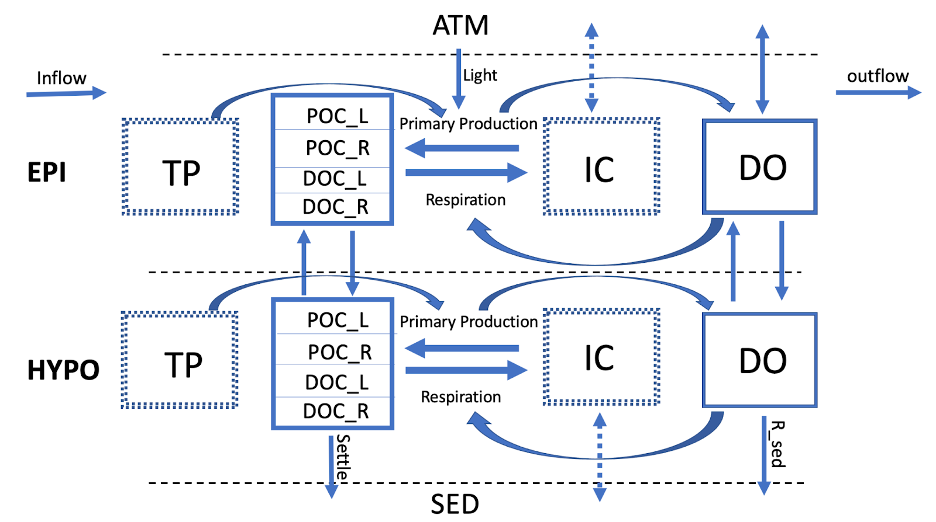

# Summary
This repository includes code, data, and configuration files for running a 1-D aquatic ecosystem model for the purpose of studying organic carbon dynamics in north-temperate lakes. The model was run for six lakes on a daily timestep from 1995-2014, over two layers (surface layer and bottom layer). 

The output for the model contains layer-specific predictions for state variables including recalcitrant and labile dissolved organic carbon (DOC_R, DOC_L), recalcitrant and labile particulate organic carbon (POC_R, POC_L), and dissolved oxygen (DO). Physical and metabolism fluxes, which are used to calculate state variables, are generated and tracked for each time step as well. All state variables and fluxes are in mass units (grams). See conceptual model diagram below:



Inorganic carbon (IC) is not tracked in the model and is assumed to be a non-limiting substrate to primary production. Total phosphorus (TP) is used as a driving variable for primary production in the lake.


All data were obtained through open-access online repositories (NTL-LTER, USGS).

# Contents
The six lakes are organized by their respective identifiers from the high resolution National Hydrography Dataset (NHD):
* nhdhr_143249470 = Lake Mendota
* nhdhr_143249640 = Lake Monona
* nhdhr_69886156 = Allequash Lake
* nhdhr_69886228 = Trout Lake
* nhdhr_69886284 = Big Muskellunge Lake
* nhdhr_69886444 = Sparkling Lake

More information on each lake can be found here: https://lter.limnology.wisc.edu/about/lakes

### R_code and running the model
The R_code folder contains all scripts needed to run the model, calculate uncertainty, and visualize the model results. Each lake is run individually, and must be specified before running. 

```R
# specify the lake to run by using the nhd identifier
nhdid <-  "nhdhr_143249470" #Mendota
```

`run_model_script.R` is the primary document used for model set up and execution, and borrows functions from the following scripts:
* `td_assign_model_script.R`: calculates stratification and mixing dynamics in model
* `volume_weighted_avg_model_script.R`: caclulates volume weighted averages for lake temperature and observational data 
* `obs_data_create_model_script.R`: organizes observational data used in running the model
* `main_metab_function_model_script.R`: contains the main model code for calculating state variables and fluxes

After running the model, `calculate_uncertainty_model_script.R` is used to calcuate model uncertainty.

The last step is to use `figure_creation model_script' to visualize model output.

### config_files
The config_files folder contains model configuration information that is specific for each lake. These files include:
* `*_config_fil.csv` = file for lake parameter configuration

* `*.nml` = nml file for lake specific information such as morphometry and coordinate information

* `hydro_inputs.csv` / `hydro_outputs.csv` = derived hydrology information that is specific for each lake (not included for Lake Monona)

* `me_outflows.csv` = model output from Lake Mendota (used as hydrology input only for Lake Monona) 


### data
The data folder contains input data used for running the model and observational data for each lake. The derived temperature profiles, ice flags, and the meteorology data was taken from the USGS data product: Process-based predictions of lake water temperature in the Midwest US. Water quality data was taken from the NTL_LTER. These files include:
 * `pball_*_temperatures.csv`: derived temperature profiles from the USGS data product
 
 * `pball_*_ice_flag.csv` : flags for the presence or absence of ice on lake surface 

 * `NLDAS_*.csv`: meteorology data used to drive the model

 * `wq_data.csv`: water quality data used for model calibration and validation
 
 
